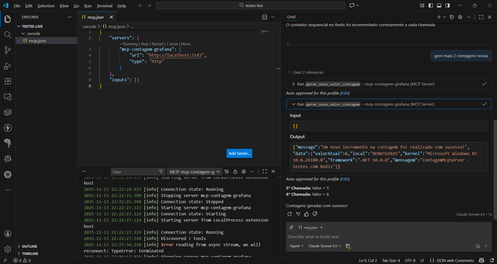

# aspnetcore10-mcp-otel-grafana-redis_contagem
Implementação em ASP.NET Core + .NET 10 de MCP Server para contagem de acessos a partir de uma instância do Redis. Inclui o uso de um script do Docker Compose para monitoramento/observabilidade com OpenTelemetry + Grafana.

## Testes

Testes deste MCP Server com Visual Studio Code + GitHub Copilot:

Um dos traces gerados no Grafana, a partir do uso de OpenTelemetry + Alloy + Tempo:

